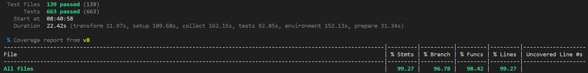
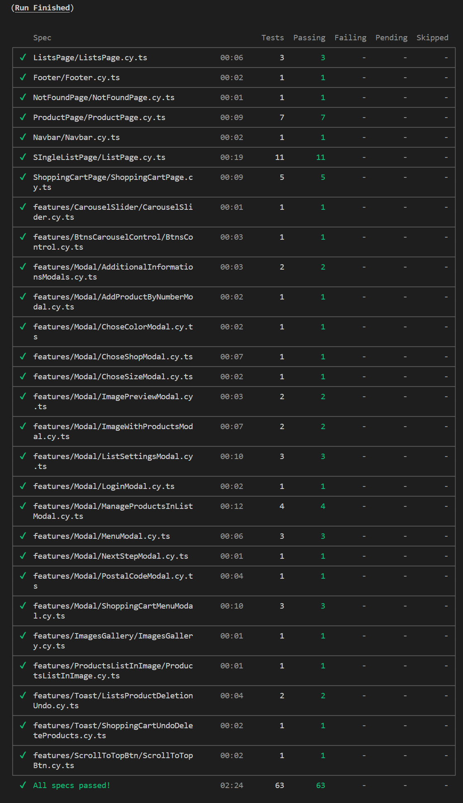
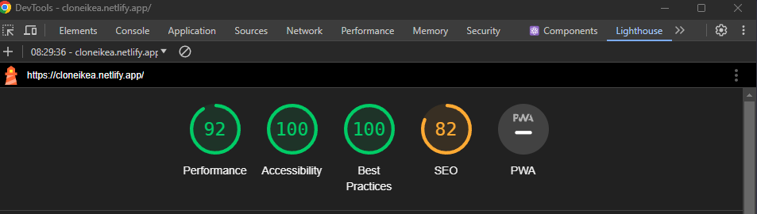

# IKEA - clone

Original [IKEA](https://www.ikea.com/pl/pl/) page.

Link to to my [ikea clone page](https://cloneikea.netlify.app/).

Build with **React**, **TypeScript** and **SCSS**.

## Watch video how application works:

- for [desktop](https://ikea-clone-video-desktop-preview.netlify.app/)
- for [mobile](https://ikea-clone-video-mobile-preview.netlify.app/)

## Used Libraries

- **react-router-dom**
- **[Swiper](https://swiperjs.com/)** for carousel sliders
- **[date-fns](https://date-fns.org/)** for handling dates
- **[react-intersection-observer](https://www.npmjs.com/package/react-intersection-observer)**

## Technologies used for testing

- **vitest** with **react-testing-library** for unit and integration tests.

  

- **Cypress** for e2e tests.
  

## Performance and Accessibility

App is well optimized for performance, features loading states, and is fully accessible. It meets all accessibility standards.

